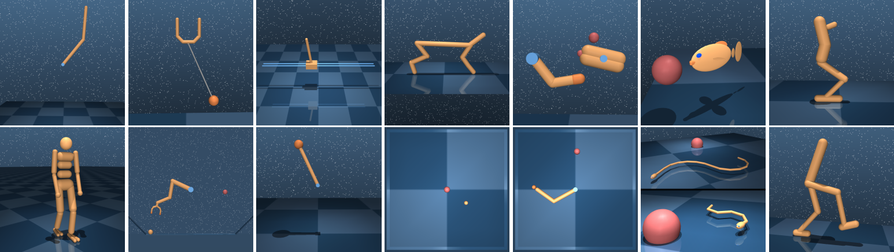

# `dm_control`: The DeepMind Control Suite and Package

# 

This package contains:

-   [`dm_control.mjcf`]: A library for composing and modifying MuJoCo MJCF
    models in Python.

-   [`dm_control.mujoco`]: Libraries that provide Python bindings to the MuJoCo
    physics engine.

-   [`dm_control.suite`]: A set of Python Reinforcement Learning environments
    powered by the MuJoCo physics engine.

-   [`dm_control.viewer`]: An interactive environment viewer.

If you use this package, please cite our accompanying [tech report].

## Installation and requirements

Follow these steps to install `dm_control`:

1.  Download MuJoCo Pro 2.00 from the download page on the [MuJoCo website].
    MuJoCo Pro must be installed before `dm_control`, since `dm_control`'s
    install script generates Python [`ctypes`] bindings based on MuJoCo's header
    files. By default, `dm_control` assumes that the MuJoCo Zip archive is
    extracted as `~/.mujoco/mujoco200_$PLATFORM` where `$PLATFORM` is either
    `linux`, `win64`, or `macos`.

2.  Install the `dm_control` Python package by running `pip install
    git+git://github.com/deepmind/dm_control.git` (PyPI package coming soon) or
    by cloning the repository and running `pip install /path/to/dm_control/`. We
    recommend `pip install`ing into a `virtualenv`, or with the `--user` flag to
    avoid interfering with system packages. At installation time, `dm_control`
    looks for the MuJoCo headers from Step 1 in
    `~/.mujoco/mujoco200_$PLATFORM/include`, however this path can be configured
    with the `headers-dir` command line argument.

3.  Install a license key for MuJoCo, required by `dm_control` at runtime. See
    the [MuJoCo license key page] for further details. By default, `dm_control`
    looks for the MuJoCo license key file at `~/.mujoco/mjkey.txt`.

4.  If the license key (e.g. `mjkey.txt`) or the shared library provided by
    MuJoCo Pro (e.g. `libmujoco200.so` or `libmujoco200.dylib`) are installed at
    non-default paths, specify their locations using the `MJKEY_PATH` and
    `MJLIB_PATH` environment variables respectively.

## Rendering

The MuJoCo Python bindings support three different OpenGL rendering backends:
EGL (headless, hardware-accelerated), GLFW (windowed, hardware-accelerated), and
OSMesa (purely software-based). At least one of these three backends must be
available in order render through `dm_control`.

*   Hardware rendering with a windowing system is supported via GLFW and GLEW.
    On Linux these can be installed using your distribution's package manager.
    For example, on Debian and Ubuntu, this can be done by running `sudo apt-get
    install libglfw3 libglew2.0`. Please note that:

    -   [`dm_control.viewer`] can only be used with GLFW.
    -   GLFW will not work on headless machines.

*   "Headless" hardware rendering (i.e. without a windowing system such as X11)
    requires [EXT_platform_device] support in the EGL driver. Recent Nvidia
    drivers support this. You will also need GLEW. On Debian and Ubuntu, this
    can be installed via `sudo apt-get install libglew2.0`.

*   Software rendering requires GLX and OSMesa. On Debian and Ubuntu these can
    be installed using `sudo apt-get install libgl1-mesa-glx libosmesa6`.

By default, `dm_control` will attempt to use GLFW first, then EGL, then OSMesa.
You can also specify a particular backend to use by setting the `MUJOCO_GL=`
environment variable to `"glfw"`, `"egl"`, or `"osmesa"`, respectively.

## Additional instructions for Homebrew users on macOS

1.  The above instructions using `pip` should work, provided that you use a
    Python interpreter that is installed by Homebrew (rather than the
    system-default one).

2.  Before running, the `DYLD_LIBRARY_PATH` environment variable needs to be
    updated with the path to the GLFW library. This can be done by running
    `export DYLD_LIBRARY_PATH=$(brew --prefix)/lib:$DYLD_LIBRARY_PATH`.

[EXT_platform_device]: https://www.khronos.org/registry/EGL/extensions/EXT/EGL_EXT_platform_device.txt
[MuJoCo license key page]: https://www.roboti.us/license.html
[MuJoCo website]: http://www.mujoco.org/
[tech report]: https://arxiv.org/abs/1801.00690
[`ctypes`]: https://docs.python.org/2/library/ctypes.html
[`dm_control.mjcf`]: dm_control/mjcf/README.md
[`dm_control.mujoco`]: dm_control/mujoco/README.md
[`dm_control.suite`]: dm_control/suite/README.md
[`dm_control.viewer`]: dm_control/viewer/README.md
