# Export Mujoco models from Blender

## Prerequisites

The MuJoCo exporter works as Blender addon, tested with ver 3.4.1. You can
download Blender from [https://www.blender.org](https://www.blender.org/).

## Installation

### Preparing a plugin installer

The `install.sh` command will deploy the installable version of the plugin to
`./addons/mujoco_model_exporter`. This folder should be zipped:

```shell
$ cd ./addons && zip -r mujoco_model_exporter.zip mujoco_model_exporter/*
```

### Installing the plugin in Blender

Open Blender and select `Edit/Preferences` menu option.

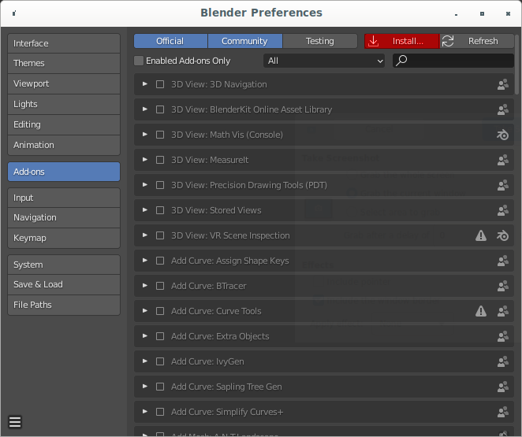{style="display:block;margin:auto"}

Clicking the Install button will open a file selection dialog that will allow
you to select the .zip archive with the plugin.

The next window will follow, listing the installed plugin and allowing you to
enable it.

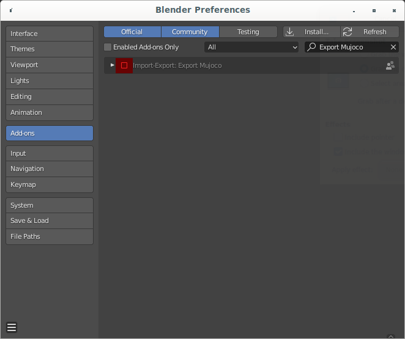{style="display:block;margin:auto"}

Check the checkbox next to its name to enable it.

## Modelling for Mujoco.

The plugin was designed to allow the artists to keep using core Blender features
when building models for Mujoco.

feature        | Mujoco                    | Blender
-------------- | ------------------------- | -----------------------------------
kinematic tree | hierarchy of Bodies       | Armatures or hierarchies of Objects
geometry       | Geoms                     | Meshes
materials      | Material + Texture assets | Material + Texture definitions
lighting       | Lights                    | Lights

### Node naming

The exporter will copy the names of the bones, meshes and lights. Mujoco joints
will be named after the bone that owns the respective constraint, with a postfix
denoting the degree of freedom they enable.

### Modelling kinematic trees using Armatures and IK

Blender Armatures allow to model kinematic capabilities of a Blender model. They
comprise a tree of bones, each of which can be further extended with IK
Constraints.

Only the bones affected by an IK chain will receive appropriate degrees of
freedom. This means that if you export a model without any IK chains, it will be
exported as a static model.

#### IK Constraints and bone limits

IK constraints offer the easiest way to verify how a kinematic chain would
behave in a physical environment. For that reason we chose to use them, along
with IK bone limits, to model Mujoco joints.

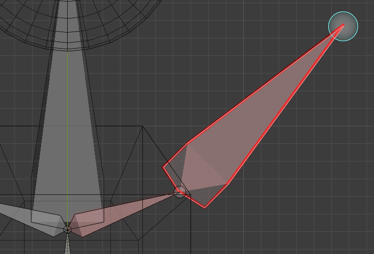

*   Select the bone at the end of a kinematic chain,

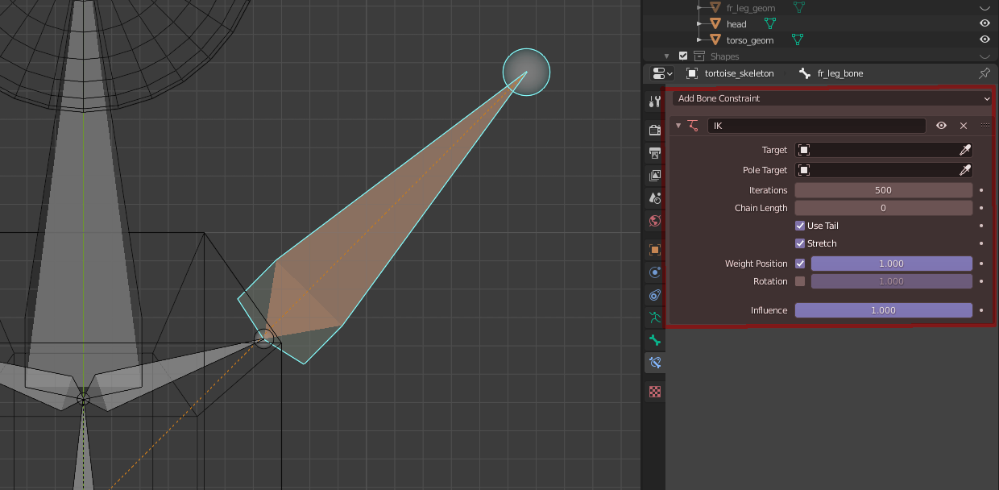

*   Add an IK Bone Constraint to it.
    [This webpage](https://docs.blender.org/manual/en/latest/animation/constraints/tracking/ik_solver.html)
    contains detailed instructions.

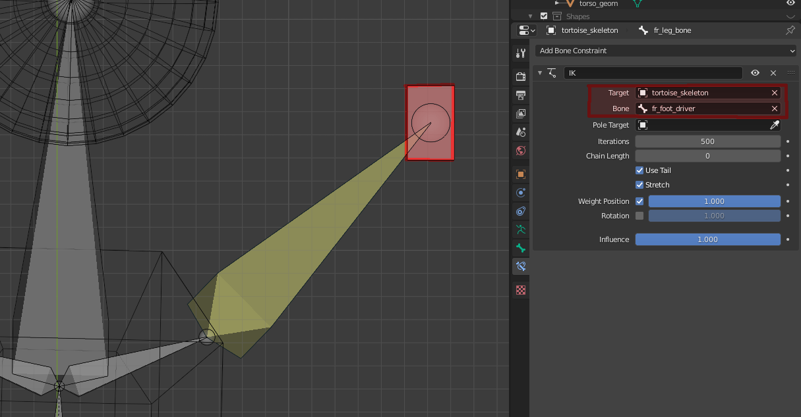

*   Add a target bone to the scene and use it as the IK constraint's target.

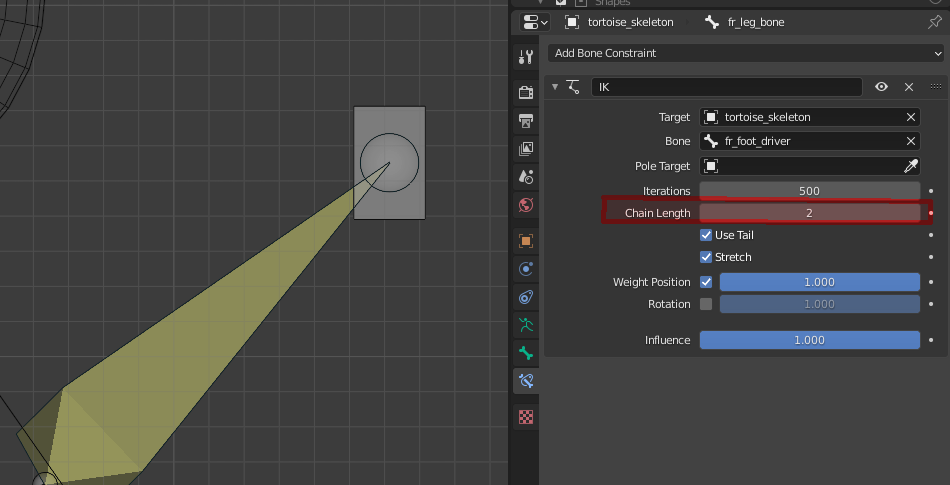

*   Adjust the `Chain Length` value to reflect the number of parent bones that
    should become a part of this IK chain.

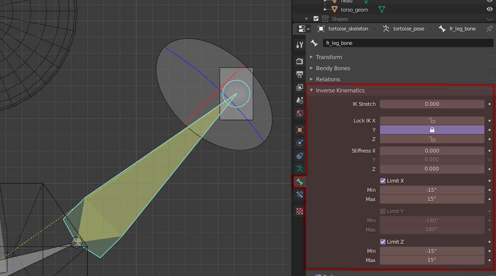

*   For each of the bones in the chain, visit the `Bone/Inverse Kinematics` tab
    and adjust the locks and bone limits.

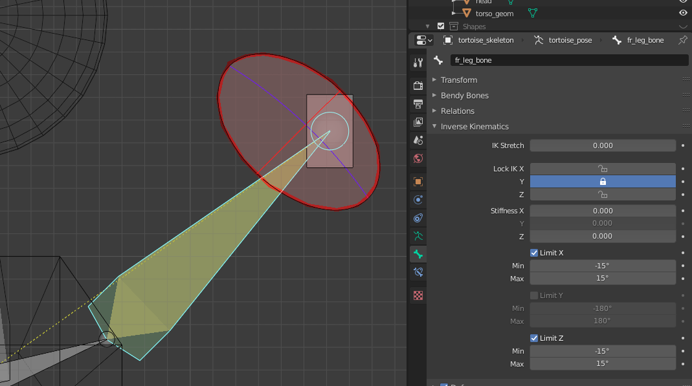

*NOTE*: you can take advantage of a helpful limit visualization gizmo.

### Armature free joints.

Armatures form the kinematic trees, so it makes sense to give their roots all 6
degrees of freedom.

This behavior can be changed by disabling the `Armature freejoint` export
option.

### Modelling the geometry

Mujoco uses parametric geometry comprised of primitive shapes such
as cubes, spheres and capsules. It does support triangle based mesh geometry
however.

Blender on the other hand deals exclusively in meshes, and even though it
contains a palette of such primitive shapes, these are not parametric.

#### MSH files

The exporter therefore exports the geometry as meshes. All meshes referenced by
the scene are exported into Mujoco's native .msh format.

When this plugin was created, the native .msh format was the only format to
support texture mapping.  Since MuJoCo 2.1.2, `.obj` files are supported. The
`.msh` format is expected to be deprecated and removed soon. Until this plugin
is updated to output `.obj` files we recommend all user to convert their `.msh`
files to `.obj` files using [this](https://github.com/google-deepmind/mujoco/blob/main/python/mujoco/msh2obj.py) utility.

#### Phong lighting model and lack of support for Cycles nodes

Mujoco implements a forward rendering model with Phong lightning and support for
reflective surfaces.

[Mujoco material definition](http://www.mujoco.org/book/XMLreference.html#material)
is fixed and limited to:

*   base color (diffuse color)
*   specularity coefficient
*   smoothness coefficient
*   reflectiveness coefficient

These parameters translate well to Blender's default material definition, which
should be used to model the materials exported to Mujoco.

Due to the diversity and open-ended nature of Cycle's material nodes, the choice
was made not to support materials defined using them.

#### Division of meshes that employ multiple materials

Mujoco renderer supports a single material per mesh, in contrast to Blender's
multi material model. In order to support meshes with multiple materials, the
exporter divides them into submeshes, each of which uses a single material.

Since Blender materials are applied to faces, and a single face may only have a
single material assigned, there is no risk that the subdivided mesh will exhibit
any overlapping artifacts.

#### Effect of mesh division on inertia and mass.

The exported submeshes will have different geometry and volume than the
original. This will affect the mass and inertia of the geom that uses the
exported mesh.

Please note that Mujoco derives these quantities not from the mesh itself, but
rather from the convex hull calculated for it. The sum of hulls of subdivided
meshes are not guaranteed to be equal to the hull of the original mesh.

This phenomenon is illustrated on the image below.

Blender                       | Mujoco renderer                 | Mujoco convex hulls
----------------------------- | ------------------------------- | -------------------
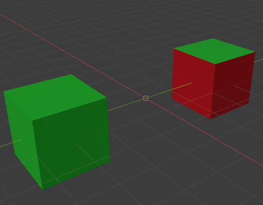 | 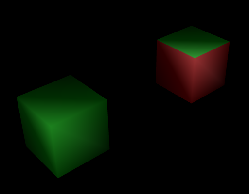 | 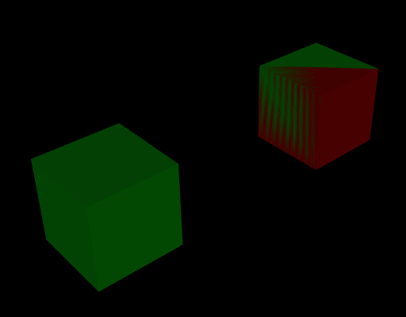

A different material was assigned to 2 out of 6 rectangular faces of the right
cube, causing that mesh to be split into two submeshes.

While they render well in Mujoco, the Moiré effect visible on the convex hull
comes from two overlapping hulls, each with a different volume.

#### Double-sided materials

Double sided materials cause the meshes (or faces) that use them to be exported
with the faces duplicated with the reverse face winding order. This is because
Mujoco renderer does not support any other face culling modes than back face
culling.

*CAUTION*: Because this operation affects the exported geometry, it may
indirectly affect the physical properties of a geom that references that mesh,
such as its mass and inertia. Please use this feature with caution.

#### Scaling

*CAUTION*: If you are using the scaling transform, the exporter will modify your
scene!

The exporter will by default reset the scaling transform on all bones and meshes
to ensure affine reference frame transformations.

This operation can be undo'ed after the exporter is completed, but the exporter
doesn't undo it automatically!

### Textures

*NOTE*: This feature will be added in the next version of the exporter.

#### One texture channel

Mujoco renderer supports a single texture channel. It's therefore advised to use
a single UV map for meshes that are to be exported to Mujoco.

#### Choice between atlases and individual textures

Mujoco's fixed rendering pipeline is quite fast, and handles both variants well.
Therefore we leave it up to the artist to decide which it prefers using.

Please keep in mind that the exporter doesn't export the texture assets. Those
should be copied into the folder with the exported model manually.
