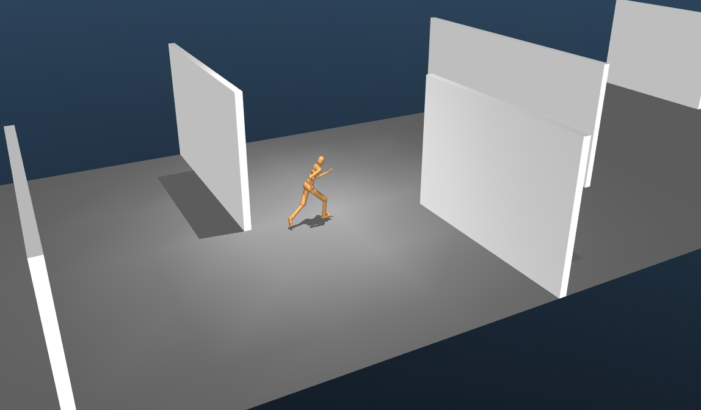
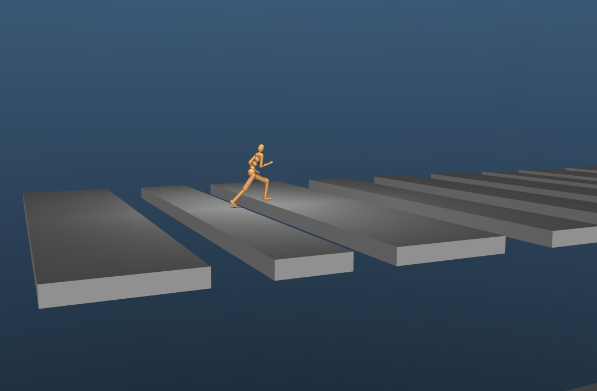

# Locomotion task library

This package contains reusable components for defining control tasks that are
related to locomotion. New users are encouraged to start by browsing the
`examples/` subdirectory, which contains preconfigured RL environments
associated with various research papers. These examples can serve as starting
points or be customized to design new environments using the components
available from this library.

<p float="left">
  
  
</p>

**NOTE:** Rodent walker model and examples will be made available as part of
this library before the ICLR 2020 conference.

## Terminology

This library facilitates the creation of environments that require **walkers**
to perform a **task** in an **arena**.

-   **walkers** refer to detached bodies that can move around in the
    environment.

-   **arenas** refer to the surroundings in which the walkers and possibly other
    objects exist.

-   **tasks** refer to the specification of observations and rewards that are
    passed from the "environment" to the "agent", along with runtime details
    such as initialization and termination logic.

## Installation and requirements

See [the documentation for `dm_control`][installation-and-requirements].

## Quickstart

```python
from dm_control import composer
from dm_control.locomotion.examples import basic_cmu_2019
import numpy as np

# Build an example environment.
env = basic_cmu_2019.cmu_humanoid_run_walls()

# Get the `action_spec` describing the control inputs.
action_spec = env.action_spec()

# Step through the environment for one episode with random actions.
time_step = env.reset()
while not time_step.last():
  action = np.random.uniform(action_spec.minimum, action_spec.maximum,
                             size=action_spec.shape)
  time_step = env.step(action)
  print("reward = {}, discount = {}, observations = {}.".format(
      time_step.reward, time_step.discount, time_step.observation))
```

[`dm_control.viewer`] can also be used to visualize and interact with the
environment, e.g.:

```python
from dm_control import viewer

viewer.launch(environment_loader=basic_cmu_2019.cmu_humanoid_run_walls)
```

## Publications

This library contains environments that were adapted from several research
papers. Relevant references include:

-   [Emergence of Locomotion Behaviours in Rich Environments (2017)][heess2017].

-   [Learning human behaviors from motion capture by adversarial imitation
    (2017)][merel2017].

-   [Hierarchical visuomotor control of humanoids (2019)][merel2019a].

-   [Neural probabilistic motor primitives for humanoid control (2019)][merel2019b].

-   [Deep neuroethology of a virtual rodent (2020)][merel2020] -- code coming
    soon.

[installation-and-requirements]: ../../README.md#installation-and-requirements
[`dm_control.viewer`]: ../viewer/README.md
[heess2017]: https://arxiv.org/abs/1707.02286
[merel2017]: https://arxiv.org/abs/1707.02201
[merel2019a]: https://arxiv.org/abs/1811.09656
[merel2019b]: https://arxiv.org/abs/1811.11711
[merel2020]: https://openreview.net/pdf?id=SyxrxR4KPS
