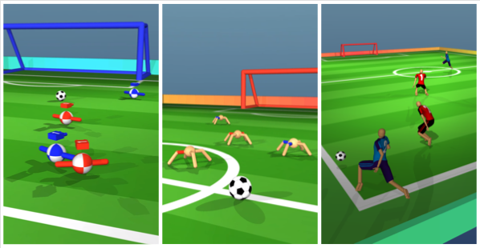

# DeepMind MuJoCo Multi-Agent Soccer Environment.

This submodule contains the components and environment used in the following
works.

* [Emergent Coordination through Competition][boxhead].
* [From Motor Control to Team Play in Simulated Humanoid Football][humanoid].

# 

## Installation and requirements

See [dm_control](../../../README.md#installation-and-requirements) for instructions.

## Quickstart

```python
import numpy as np
from dm_control.locomotion import soccer as dm_soccer

# Instantiates a 2-vs-2 BOXHEAD soccer environment with episodes of 10 seconds
# each. Upon scoring, the environment reset player positions and the episode
# continues. In this example, players can physically block each other and the
# ball is trapped within an invisible box encapsulating the field.
env = dm_soccer.load(team_size=2,
                     time_limit=10.0,
                     disable_walker_contacts=False,
                     enable_field_box=True,
                     terminate_on_goal=False,
                     walker_type=dm_soccer.WalkerType.BOXHEAD)

# Retrieves action_specs for all 4 players.
action_specs = env.action_spec()

# Step through the environment for one episode with random actions.
timestep = env.reset()
while not timestep.last():
  actions = []
  for action_spec in action_specs:
    action = np.random.uniform(
        action_spec.minimum, action_spec.maximum, size=action_spec.shape)
    actions.append(action)
  timestep = env.step(actions)

  for i in range(len(action_specs)):
    print(
        "Player {}: reward = {}, discount = {}, observations = {}.".format(
            i, timestep.reward[i], timestep.discount, timestep.observation[i]))
```

## Rewards

The environment provides a reward of +1 to each player when their team
scores a goal, -1 when their team concedes a goal, or 0 if neither team scored
on the current timestep.

In addition to the sparse reward returned the environment, the player
observations also contain various environment statistics that may be used to
derive custom per-player shaping rewards. See `environment.observation_spec()`
for the additional statistics available to the agents.

## Episode terminations

If `terminate_on_goal` is set to `True`, episodes will terminate immediately
with a discount factor of 0 when either side scores a goal or if the
`time_limit` elapsed. If neither team scores within this time then the episode
will terminate with a discount factor of `1.0`.

If `terminate_on_goal` is set to `False`, players and ball positions are
randomly initialized if either team scores a goal. Episodes always terminate
after `time_limit` with a discount factor of `1.0`.

## Environment Viewer

To visualize an example environment instance using the `dm_control` interactive
viewer, execute `dm_control/locomotion/soccer/explore.py`.

[boxhead]: https://sites.google.com/corp/view/emergent-coordination/home
[humanoid]: https://arxiv.org/abs/2105.12196
